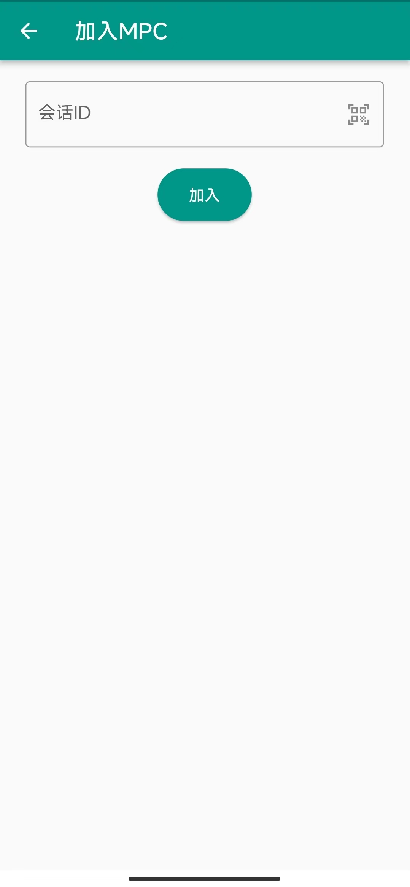
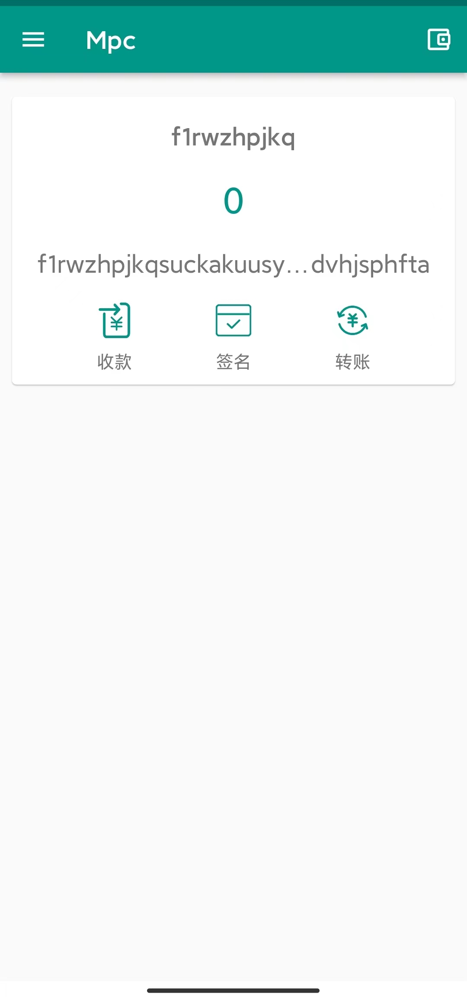

# 创建MPC钱包

1、打开Soter APP，点击【导入钱包】按钮

 

2、选择钱包页，点击【+】按钮，创建MPC

 

3、输入需创建MPC钱包的总人数和签名人数后，点击【确定】按钮（总人数需大于或等于2人，签名人数需小于或等于总人数）

4、等待需要加入MPC的设备扫码加入

5、在需要加入MPC的设备上，点击【+】按钮，加入MPC

6、在加入MPC页，点击扫码图标，进行扫码

7、扫码成功后，点击【加入】按钮

8、MPC钱包创建成功

9、MPC钱包具有收款、签名、转账功能（新生成的MPC钱包金额为0，金额需大于0才可使用转账功能）

10、点击【收款】按钮，显示收款二维码，扫描该二维码可进行收款

11、点击【转账】按钮，进入转账页后，输入接受地址和转账金额，点击确定，可进行签名

12、等待其他MPC钱包的设备签名

13、在需要签名的MPC的设备，选择需转账的MPC钱包，点击【签名】按钮，进入签名信息页，点击扫码图标，进行扫码，加入

14、设备签名成功后，点击【发送】按钮，进行上链

15、交易成功

